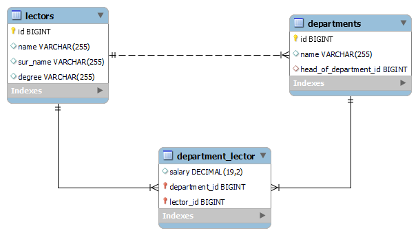

# <h1 align="center">👨🏻‍🏫"University" test task for BotsCrew👨🏻‍🏫</h1>

###  Introduction
`A simple Spring Boot java project with the console interface for university, which consists of departments and lectors. The lectors could work in more than one department. A lector could have one degree (assistant, associate professor, professor).`

### 🦾 Features
1. Show head of department
2. Show statistics for department
3. Show the average salary for the department
4. Show count of employee for department
5. Global search for a lecturer 

###  Technologies Used
`The following technologies are used to build the Car Sharing Service:`
-  **Java**: The primary programming language used for the application.
-  **Spring Boot**: A powerful framework that provides essential features for building web applications.
-  **Spring Data JPA**: Simplifies data access and persistence with JPA (Java Persistence API).
-  **MySQL**: The database management system used for data storage.
-  **Lombok**: Reduces boilerplate code with annotations.
-  **Liquibase**: Database-independent library for tracking, managing and applying database schema changes.

###  Getting Started
`Before running the Car Sharing Service, ensure you have the following installed:`
-  Java Development Kit (JDK)

`Follow the steps below to install:`
1. Clone the repository from GitHub and navigate to the project directory.
2. Change the settings in the `resources/db.properties` file to your personal ones.
    ```
    spring.datasource.driver-class-name=YOUR_DRIVER
    spring.datasource.url=YOUR_DATABASE_URL
    spring.datasource.username=YOUR_USERNAME
    spring.datasource.password=YOUR_PASSWORD
    ```
3. Run the project.

###  Database structure:
#### <h4 align="center">  </h4>
